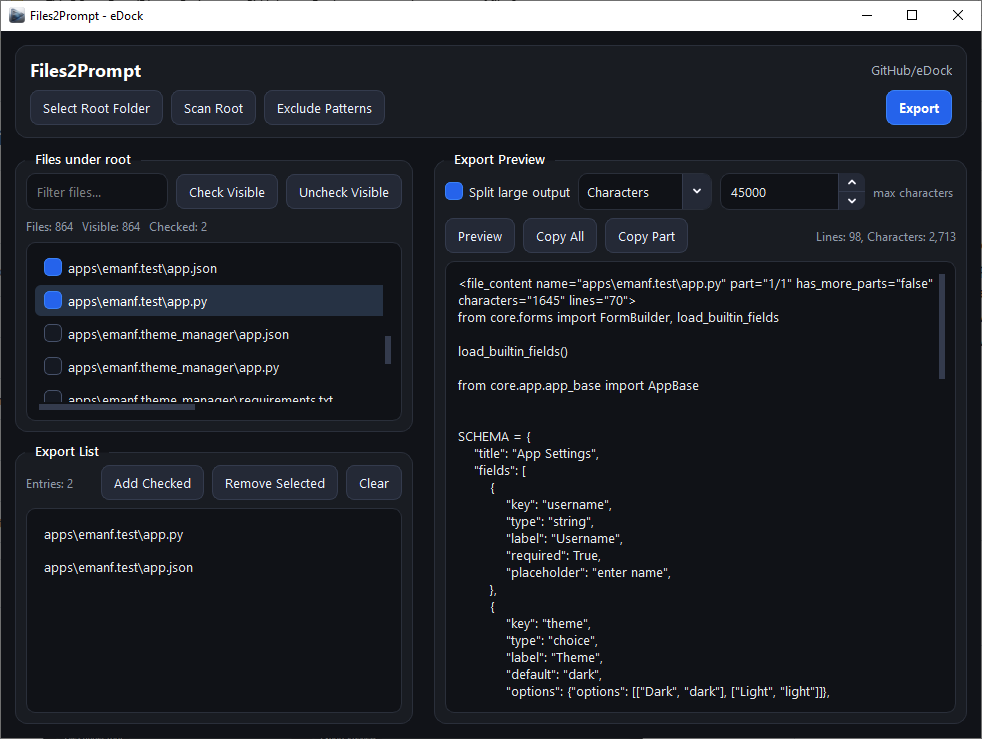

# eDock Files2Prompt

A simple eDock app for exporting file contents into a clean text format.

## Purpose

This app helps you collect selected files from a project and export their content so you can easily share it with AI assistants for debugging, code review, or development help.

## Features

- Select project files
- Export file contents as readable text
- Prepare code context for AI tools
- Keep the output simple and clean

## Usage

1. Open <a href="https://github.com/emanf/eDock">eDock</a>.
2. Launch Files2Prompt app.
3. Select the root folder.
4. Select the files you want to export.
5. Copy or save the exported content.
6. Send it to an AI assistant when needed.

## App Info

- App name: eDock Files2Prompt
- Type: eDock app
- Purpose: Export file content for AI assistance
